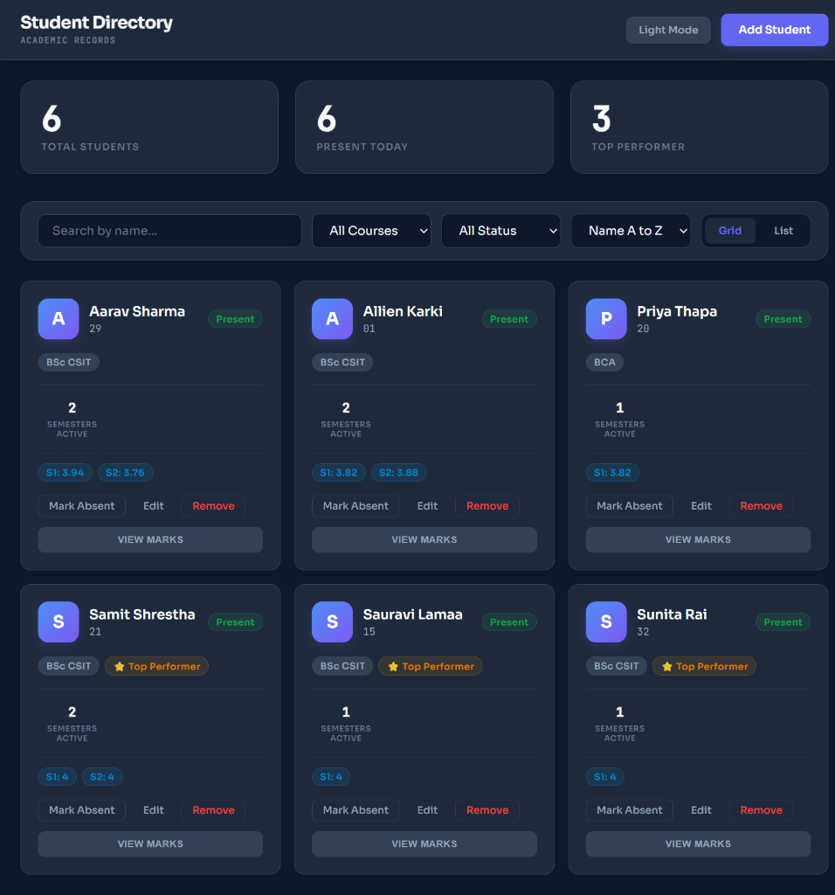

# Student Directory

This is a simple student management website I built specifically for TU (Tribhuvan University) standards. It helps track student records, attendance, and handles all those academic calculations that usually take a lot of time.

---

## Features

- **Student Records**: You can add, edit, or delete student info easily.
- **Attendance**: Just a simple toggle to mark students present or absent for the day.
- **GPA Stuff**: It follows TU Nepal grading. It handles the 60/40 marks split and the 40% pass rule automatically. No more manual math.
- **Grades & Divisions**: Shows letter grades (A, B+, etc.) and works out the classification (Distinction, First Division, etc.) based on performance.
- **View Modes**: You can look at students in a grid of cards or a clean list view depending on what you prefer.
- **Dark Mode**: Supports both light and dark themes.
- **No Database Needed**: Everything saves to your browser's local storage, so it's ready to go immediately.

---

## Getting Started

To get this running on your machine:

1. **Clone it**:
   ```bash
   git clone <your-repository-url>
   cd directory
   ```

2. **Install things**:
   ```bash
   npm install
   ```

3. **Run it**:
   ```bash
   npm start
   ```
   The app will open at `http://localhost:5173`.

---

## Preview

Here is a look at the dashboard:



